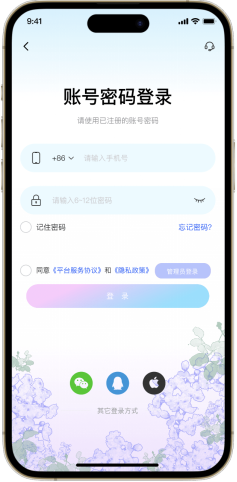

# NiftiHub

A Flutter project.

随着数字藏品得益于元宇宙的火爆而迅速发展，我国数字藏品市场已具备一定规模。随之面临的问题有数字藏品平台存在安全隐患，藏品有伪造侵权风险，基于区块链技术所带来的交易吞吐量受限。NiftiHub基于Corda区块链平台开发了一个数字藏品管理与交易系统，针对市场痛点，提供客户端、管理端，集成了数字藏品展示、收藏、交易、审核和创作铸造等功能。

## 管理员审核操作

## 登录注册

## 首页

## 藏品交易

## 社群交流

## 藏品展示柜 

## 藏品铸造

## 客服

